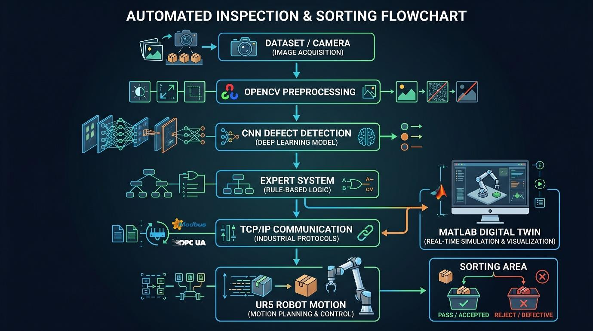

# 🏭 Fully Automated Industrial Inspection & Sorting System

### AI-Powered Digital Twin for Smart Manufacturing using Computer Vision, Robotics Optimization, MATLAB, CoppeliaSim and Hardware-in-the-Loop Integration


---

## 🎥 Full System Demonstration

The following demonstration shows the complete industrial workflow including:

- AI Vision Inspection
- CNN Defect Classification
- Expert System Decision Making
- TCP/IP Communication
- MATLAB Robotics Controller
- CoppeliaSim Digital Twin
- Arduino HMI / LCD Feedback
- Automatic Sorting of OK and Defective Parts

<p align="center">

</p>

---

# 📌 Project Overview

This project presents a complete Cyber-Physical Production System (CPPS) designed to automate industrial quality inspection and sorting operations.

The system replaces traditional manual inspection by combining Artificial Intelligence, Industrial Robotics, Digital Twin Technology, Optimization Algorithms, and Hardware-in-the-Loop Integration into a unified architecture.

A vision-based inspection module analyzes manufacturing parts moving on a conveyor belt. A trained Convolutional Neural Network (CNN) detects surface defects such as cracks and scratches. The classification result is then processed by an Expert System that generates deterministic industrial actions.

The generated command is transmitted through a TCP/IP communication network to a MATLAB-based robotics controller responsible for:

- Forward Kinematics
- Inverse Kinematics
- Pose Calculation
- Path Planning
- Trajectory Optimization

Finally, a simulated UR5 industrial robot inside CoppeliaSim performs the pick-and-place operation while a physical Arduino-based HMI displays the current system status.

---

# 🏗 System Architecture

<p align="center">

</p>

The architecture consists of four interconnected layers:

| Layer | Technology | Function |
|---------|---------|---------|
| AI Layer | Python + PyTorch | Defect Detection |
| Decision Layer | Expert System | Industrial Logic |
| Control Layer | MATLAB | Kinematics & Optimization |
| Digital Twin Layer | CoppeliaSim | Virtual Factory |
| Hardware Layer | Arduino | HMI & Monitoring |

---

# ⚡ Cyber-Physical System Architecture

The project follows a Cyber-Physical System (CPS) architecture where software and hardware continuously interact through a synchronized communication network.

```text
Camera
   │
   ▼
CNN Vision Model
   │
   ▼
Expert System
   │
   ▼
TCP/IP Network
   │
   ▼
MATLAB Controller
   │
   ▼
Optimization Engine
   │
   ▼
Inverse Kinematics
   │
   ▼
UR5 Robot
   │
   ▼
Sorting Action
   │
   ▼
Arduino HMI
