# 🏭 Fully Automated Industrial Inspection & Sorting System with Digital Twin

### AI Vision • Robotics Optimization • MATLAB • CoppeliaSim • Hardware-In-The-Loop


---

# 🎥 Full System Demonstration

> GIF will be added after video processing.


This demonstration shows the complete industrial workflow:

* Conveyor monitoring
* AI vision inspection
* CNN classification
* Expert system decision making
* MATLAB robot controller
* Optimization-based path planning
* CoppeliaSim digital twin execution
* Arduino HMI synchronization
* OK and Defective sorting cycles

---

# 📌 Project Overview

This project presents a complete **Cyber-Physical Production System (CPPS)** designed for automated industrial quality inspection and intelligent sorting.

The system combines Artificial Intelligence, Robotics, Optimization Algorithms, Digital Twin Technology, TCP/IP Communication, and Hardware-In-The-Loop integration to simulate a modern Industry 4.0 manufacturing cell.

A camera-based inspection system analyzes industrial casting parts moving on a conveyor. A custom Convolutional Neural Network (CNN) classifies each part as either **OK** or **Defective**.

The AI decision is translated by an Expert System into robotic actions, which are executed through MATLAB, optimized using multiple planning algorithms, and visualized in real-time inside a CoppeliaSim Digital Twin environment.

The final system performs fully automated inspection and sorting without human intervention.

---

# 🚀 Key Features

* Real-Time AI Vision Inspection
* Custom CNN Defect Detection Model
* Expert System Decision Layer
* TCP/IP Distributed Architecture
* MATLAB Robotics Control Center
* Forward & Inverse Kinematics
* Multi-Algorithm Optimization Framework
* CoppeliaSim Digital Twin
* Hardware-In-The-Loop Integration
* Arduino LCD & Status Indicators
* Autonomous Conveyor-Based Sorting
* Manual and Automatic Operating Modes
* Emergency Stop Functionality

---

# 🏗 System Architecture

```text
Industrial Camera
        │
        ▼
Image Acquisition
        │
        ▼
CNN Vision Model
        │
        ▼
Expert System
        │
        ▼
TCP/IP Communication
        │
        ▼
MATLAB Controller
        │
        ▼
Optimization Algorithms
        │
        ▼
Inverse Kinematics
        │
        ▼
UR5 Robot
        │
        ▼
Pick & Place Action
        │
        ▼
Arduino HMI Feedback
```

---

# 🌐 Communication Architecture

The project operates using a distributed communication framework.

```text
                    TCP/IP
        +-------------------------+
        |         MATLAB          |
        |  IK / FK / Optimizers   |
        +-----------+-------------+
                    |
                    | Port 65432
                    |
                    ▼
        +-------------------------+
        |      Python AI Core     |
        | CNN + Expert System     |
        +-----------+-------------+
                    |
                    | Port 19001
                    |
                    ▼
        +-------------------------+
        | Arduino Serial Bridge   |
        | LCD + LEDs              |
        +-------------------------+

                    ▲
                    |
                    | Port 19000
                    |
        +-------------------------+
        |      CoppeliaSim        |
        | Conveyor + UR5 + Sensor |
        +-------------------------+
```

---

# 🔧 Software Stack

### Artificial Intelligence

* Python
* PyTorch
* OpenCV
* TorchVision

### Robotics & Control

* MATLAB
* Robotics System Toolbox
* Instrument Control Toolbox
* Global Optimization Toolbox

### Digital Twin

* CoppeliaSim (V-REP)

### Hardware Layer

* Arduino UNO
* LCD Display
* LED Indicators

---

# 📂 Dataset
The dataset used in this project is not included in this repository due to size limitations.
the link to download it : https://www.kaggle.com/datasets/ravirajsinh45/real-life-industrial-dataset-of-casting-product?resource=download

The AI model was trained using an industrial casting inspection dataset containing:

* OK Parts
* Defective Parts
* Surface Cracks
* Surface Scratches
* Manufacturing Imperfections

Dataset Structure:

```text
casting_data/
├── train/
│   ├── ok_front/
│   └── def_front/
│
└── test/
    ├── ok_front/
    └── def_front/
```

Preprocessing Pipeline:

1. RGB Image
2. Grayscale Conversion
3. Resize to 64×64
4. Tensor Conversion
5. CNN Inference

---

# 🧠 AI Vision System

The inspection subsystem was developed using PyTorch and OpenCV.

Processing Pipeline:

Camera → Image Processing → CNN → Classification → Expert System

### Camera Initialization

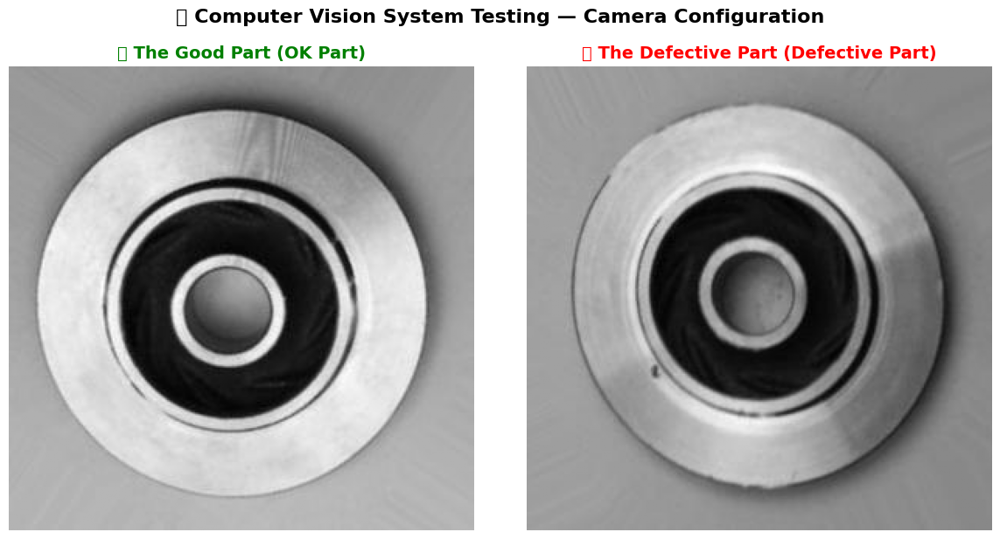

### Image Processing Pipeline

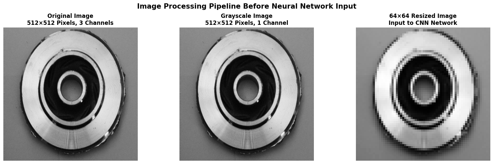

### Histogram Analysis

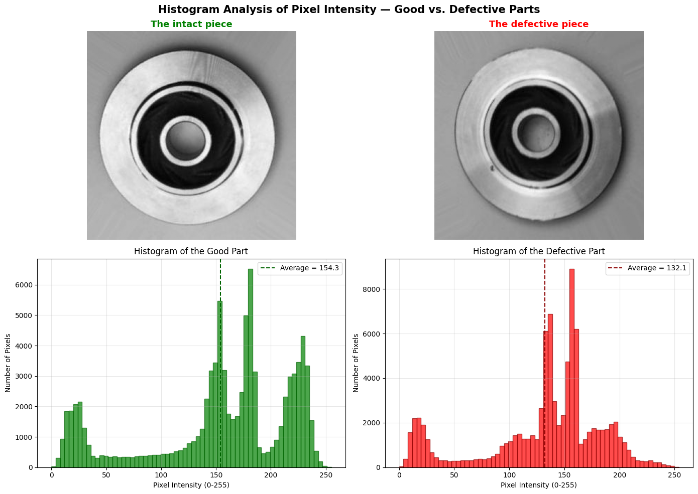

### Detailed Image Analysis

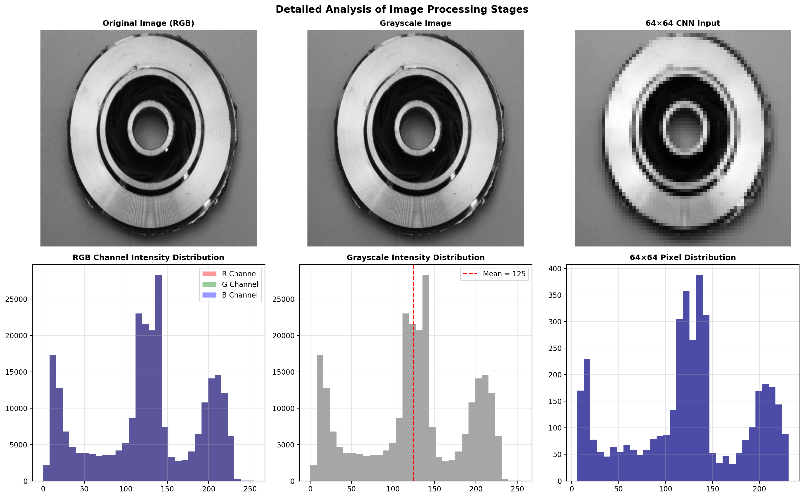

---

# 🤖 CNN Architecture

The custom CNN architecture was designed specifically for binary defect classification.

```text
Input Image (64×64×1)

        │
        ▼

Conv2D (1 → 16)

        │
        ▼

ReLU

        │
        ▼

MaxPool

        │
        ▼

Conv2D (16 → 32)

        │
        ▼

ReLU

        │
        ▼

MaxPool

        │
        ▼

Flatten

        │
        ▼

FC (8192 → 128)

        │
        ▼

ReLU

        │
        ▼

FC (128 → 2)

        │
        ▼

Output
(OK / DEFECTIVE)
```

Training Configuration:

* Optimizer: Adam
* Learning Rate: 0.001
* Loss Function: CrossEntropyLoss
* Binary Classification
* Real Industrial Dataset

---

# 📈 Model Evaluation

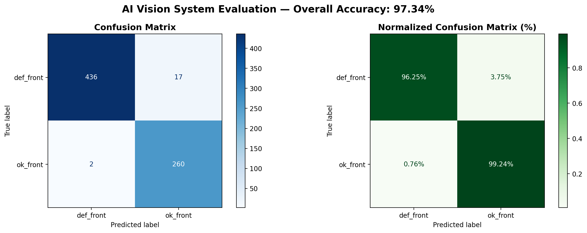

Evaluation Metrics:

* Accuracy
* Precision
* Recall
* F1 Score
* Confusion Matrix

---

# 🧩 Expert System

The Expert System converts AI predictions into deterministic industrial actions.

Decision Rules:

```text
IF Part = OK
    → Packaging Line
    → Green Bin
    → Y = +500

IF Part = Defective
    → Scrap Bin
    → Red Bin
    → Y = -500
```

Generated Outputs:

* Robot Coordinates
* Sorting Decision
* Arduino Signals
* MATLAB Commands

---

# ⚙️ MATLAB Robotics Control Center

MATLAB acts as the master controller of the entire system.

Responsibilities:

* TCP Server
* Robot Control
* Forward Kinematics
* Inverse Kinematics
* Optimization
* Benchmarking
* Digital Twin Synchronization

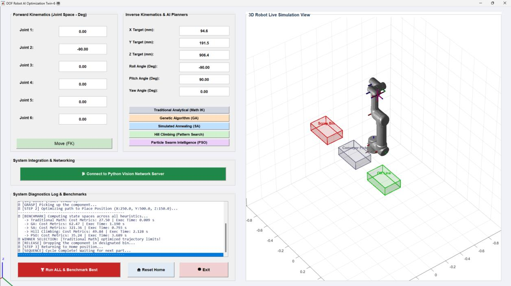

## MATLAB – OK Sorting

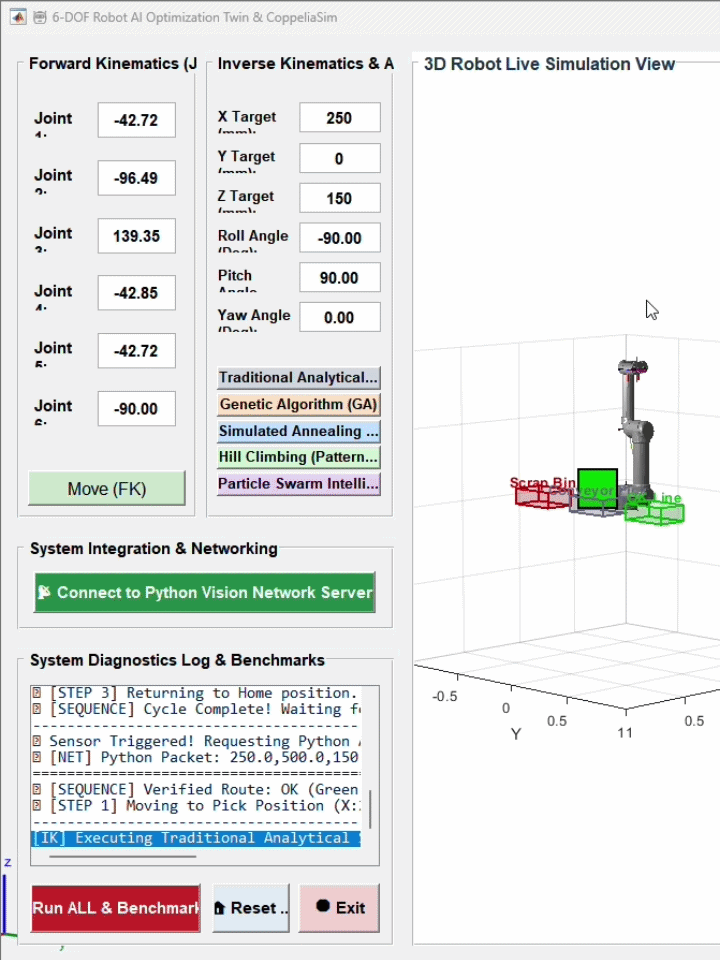

## MATLAB – Defective Sorting

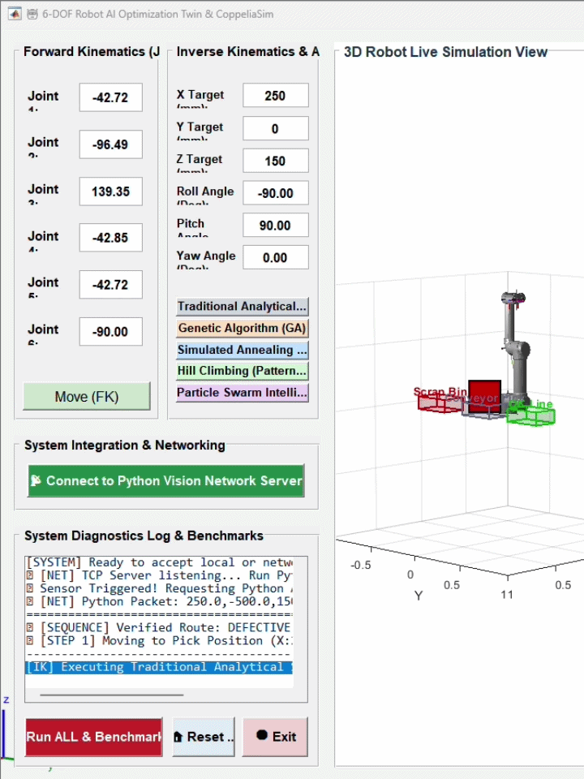

---

# 🚀 Optimization Algorithms

Implemented Path Planners:

* Analytical Inverse Kinematics
* Genetic Algorithm (GA)
* Simulated Annealing (SA)
* Particle Swarm Optimization (PSO)
* Pattern Search

Evaluation Criteria:

* Joint Motion Cost
* Energy Consumption
* Position Accuracy
* Smoothness
* Computational Time

The GUI supports:

Run ALL & Benchmark Best

for automatic comparison and optimal solution selection.

---

# 🌍 Digital Twin Environment

The industrial workcell was modeled inside CoppeliaSim.

Components:

* Conveyor Belt
* Proximity Sensor
* Sorting Stations
* UR5 Robot
* Pick-and-Place Workspace

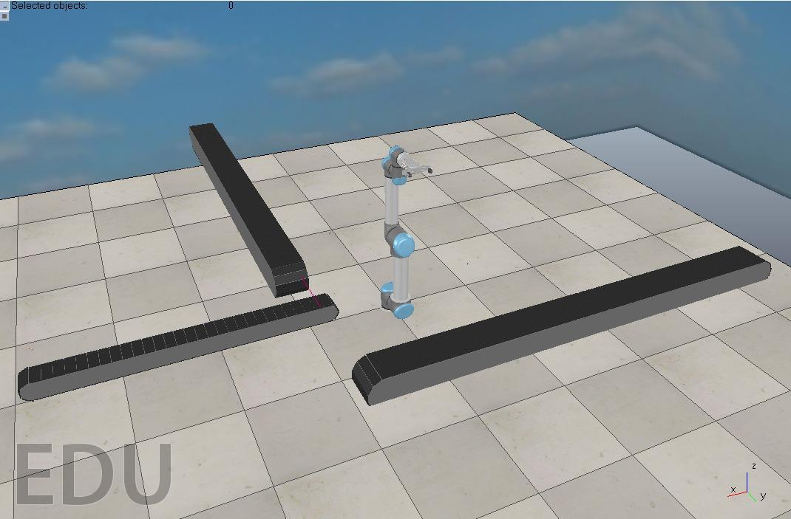

## OK Part

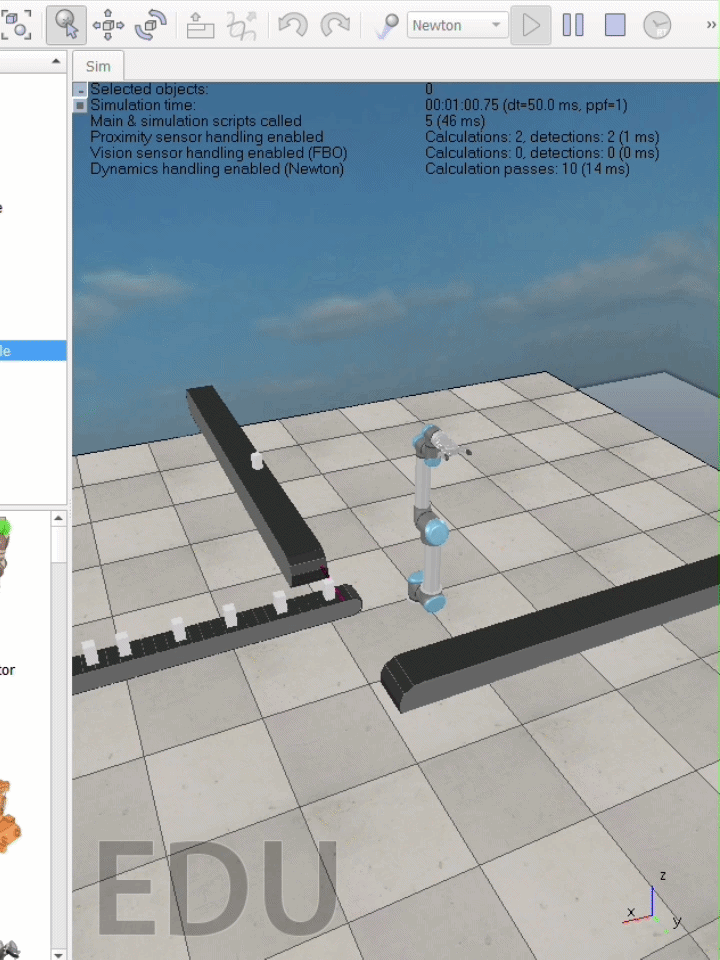

## Defective Part

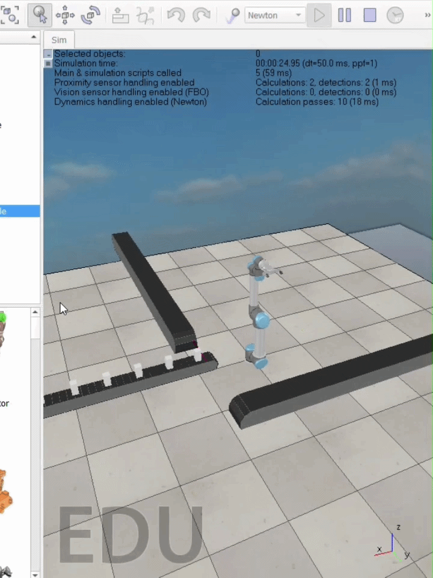

---

# 🔌 Hardware-In-The-Loop (HIL)

The project includes a physical Arduino subsystem acting as an industrial HMI.

Features:

* LCD Display
* Status LEDs
* Real-Time Feedback
* TCP-to-Serial Integration

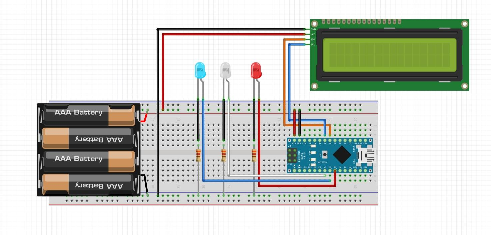

## LCD – OK


## LCD – Defective


---

# ⚙️ Operating Modes

### AUTO Mode

* Sensor Driven
* Fully Autonomous
* Continuous Production

### MANUAL Mode

* User Controlled
* Editable Coordinates
* Testing & Debugging

### Emergency Stop

Press:

Q

to safely terminate:

* Python
* MATLAB
* Arduino
* TCP Connections

---

# 📦 Installation & Setup

## 1. Clone Repository

```bash
git clone https://github.com/USERNAME/Industrial-Sorting-System.git
```

## 2. Install Python Packages

```bash
pip install torch torchvision opencv-python matplotlib pillow pyserial scikit-learn
```

## 3. Install Software

* MATLAB R2023a or newer
* CoppeliaSim
* Arduino IDE

## 4. Configure Dataset Paths

Update image paths inside:

```text
train_model.py
evaluate_model.py
realtime_conveyor.py
```

## 5. Configure Arduino Port

Update COM port in:

```text
bridge.py
```

if auto-detection fails.

---

# ▶️ Execution Order

IMPORTANT:

Run programs in the following order:

1. Launch CoppeliaSim Scene
2. Run bridge.py
3. Open MATLAB GUI
4. Click Connect
5. Run realtime_conveyor.py

The system is now fully synchronized.

---

# 🏆 Project Achievements

✔ AI-Based Defect Detection

✔ Digital Twin Implementation

✔ Hardware-In-The-Loop Integration

✔ Real-Time TCP/IP Communication

✔ Optimization-Based Motion Planning

✔ MATLAB-CoppeliaSim Synchronization

✔ Industrial Automation Workflow

✔ Industry 4.0 Concepts

---
# 🤝 Project Team & Supervision

This project was developed as part of the **MAE401 – Artificial Intelligence** course at the **Faculty of Engineering, Benha University**.

---

## Academic Supervision

<table>
<tr>

<td align="center">

<a href="PUT_DR_AMRO_LINKEDIN">


<br>

<b>Dr. Amro Shafik</b>

</a>

<br>

Project Supervisor

</td>

<td align="center">

<a href="PUT_ENG_MOHAMED_NASSER_LINKEDIN">


<br>

<b>Eng. Mohamed Nasser</b>

</a>

<br>

Teaching Assistant

</td>

</tr>
</table>

---

## Development Team

<table>
<tr>

<td align="center">

<a href="PUT_MAHMOUD_LINKEDIN">


<br>

<b>Mahmoud Mohamed Shamekh</b>

</a>

</td>

<td align="center">

<a href="PUT_OMAR_METWALLY_LINKEDIN">


<br>

<b>Omar Mahmoud Metwally</b>

</a>

</td>

</tr>

<tr>

<td align="center">

<a href="PUT_OMAR_SHOKRAN_LINKEDIN">


<br>

<b>Omar Shaaban Shokran</b>

</a>

</td>

<td align="center">

<a href="PUT_MOHAMED_ABDELTAWAB_LINKEDIN">


<br>

<b>Mohamed Abdeltawab</b>

</a>

</td>

</tr>

</table>

---

### Acknowledgments

We would like to express our sincere appreciation to our supervisors for their guidance, support, and valuable feedback throughout the development of this project.

We also thank all team members for their dedication, collaboration, and continuous efforts that contributed to the successful completion of this work.

---

# 📜 License

This repository is intended for educational, research, and demonstration purposes.
